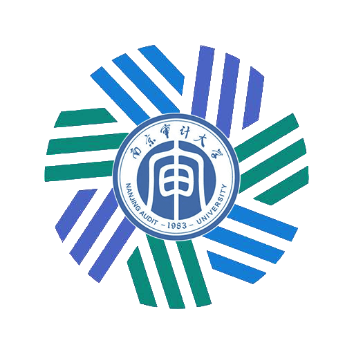

<h1>CFA 编辑部</h1>

<h5>致力于CFA专业建设事业</h5>

- [组织说明](#组织说明)
- [组织分工](#组织分工)
- [历届成员](#历届成员)
- [历届成果](#历届成果)

# 组织说明

## 组织目标

我们希望凭借CFA编辑部的力量为在校生和研究生提供更好的知识交流环境、搭建一个沟通的桥梁，为已经工作的学长姐提供更多研究合作和开办校友活动的机会，也为CFA同学们提供更多的机会和平台。

## 组织纪律

当前组织运营的纪律如下：

- 1 每位成员做事要积极主动，待人热情，勤于思考，勇于提问，借助CFA编辑部平台提升自身能力，努力营造良好的CFA编辑部工作氛围，努力建设好CFA专业

- 2 **每周**如无特别意外必须召开**核心组会**，成员需要充分交流工作进度、工作计划、工作方向等，**由总负责人整体工作安排协调，每次组会必须进行记录留档**
- 3 **每学期**组织如无特别意外必须进行一次**集体聚餐**，**每月**每个负责人必须和自己管理的成员进行一次交流
- 4 组织任何任务的派发必须制定截止时间，**如无特别意外务必在截止时间内完成**，对于时间紧但有必要的任务会增加工作压力，但请相互理解
- 5 组织任何方向如无特别意外必须制定定量指标，如每周发布几次，**如无意外务必完成指标计划**
- 6 组织成员对于困难问题如果无法解决，请不要回避，将问题记录并邀请李一繁学长一同进行讨论
- 7 组织成员对学长姐要有礼貌，对学弟妹要关心，深入了解CFA专业情况，作为开展工作的重要依据

# 组织分工

## 2021-2022 CFA编辑部分工计划

经过换届的充分沟通讨论，现让大家负责以下工作，**除陈思润同学负责编辑部整体工作事务外，其他同学负责的方向后续经过每周组会的集体讨论后可以更换**：

| 成员名称 | 职务     | 负责方向                                                     |
| -------- | -------- | ------------------------------------------------------------ |
| 陈思润   | 总负责人 | 负责编辑部整体工作安排协调                                   |
| 谢政霖   | 负责人   | 负责编辑部内部技能培训，如Python、金工、行业研究等           |
| 程沛然   | 负责人   | 负责编辑部的对外包装宣传，如招新宣传、组织活动推广等         |
| 王秋怡   | 负责人   | 负责编辑部的老师推荐读书，以及对前辈采访的相关交流活动       |
| 张佳怡   | 负责人   | 负责编辑部的咨询分享推送，如金融热点事件、金融沙龙、考证考研等 |

### 初期任务：

- **招新**：3月15日前发布并收取完毕CFA编辑部20级招新成员简历，并开始面试计划，月底前发布换届说明
- **交接**：初期需要将上届仍在开展的工作进行交接，其中：陈思润对接高镜骐，谢政霖对接丁诗琦，王秋怡对接徐博凡，张佳怡对接原禹欣，程沛然属于新方向需要自定制定工作规划

# 历届成员

## 2019-2020 CFA编辑部（原CFA编辑小组）成员

- 李一繁  13级 CFA1班  总负责人

- 高镜骐  18级 CFA2班  负责人
- 徐博凡  18级 CFA3班  负责人
- 原禹欣  18级 CFA1班  负责人
- 丁诗琦  18级 CFA3班  负责人
- 孙天佑  18级 CFA1班  负责人
- 潘徐智  18级 CFA2班  负责人
- 郑志远  18级 CFA1班  负责人
- 王佳妮  18级 CFA2班  负责人
- 李清宇  18级 CFA3班  负责人

## 2020-2021 CFA编辑部（原CFA编辑小组）成员

- 高镜骐  18级 CFA2班   总负责人
- 徐博凡  18级 CFA3班   负责人
- 原禹欣  18级 CFA1班   负责人
- 丁诗琦  18级 CFA3班   负责人
- 陈思润  19级 CFA2班   高镜骐负责
- 谢政霖  19级 CFA1班   徐博凡负责
- 张佳怡  19级 CFA3班   徐博凡负责
- 王秋怡  19级 CFA2班   原禹欣负责
- 程沛然  19级 CFA1班   丁诗琦负责

## 2021-2022 CFA编辑部成员

- 陈思润  19级 CFA2班   总负责人  
- 谢政霖  19级 CFA1班   负责人
- 张佳怡  19级 CFA3班   负责人
- 王秋怡  19级 CFA2班   负责人
- 程沛然  19级 CFA1班   负责人
- 吴彩艳  20级 CFA3班   陈思润负责 
- 朱心怡  20级 CFA2班   陈思润负责  
- 张晓菁  20级 CFA2班   谢政霖负责  
- 宋天      20级 CFA1班   谢政霖负责
- 赵东暄  20级 CFA1班   张佳怡负责
- 陈彦霏  20级 CFA2班   王秋怡负责
- 罗睿一  19级 CFA1班   程沛然负责

# 历届成果

## 2019-2020 成果

## 2010-2021 成果

# 资源分区

##  学科资源

1. 人才培养方案

[南京审计大学本科人才培养方案（2018年版）](https://pan.baidu.com/s/1yiPIgHsQBMKqYz9wlfJNkQ )

[北京大学本科人才培养方案网站（2020年版）](http://www.dean.pku.edu.cn/web/download.php)

[中国人民大学本科生培养方案（2020年版）](https://pan.baidu.com/s/14JjoqmQe_Z5-bhu4yE76vQ)

目前采取的教材和推荐书籍：

CFA系列

[CFA原版教材（2019版）](https://pan.baidu.com/s/155Mn6-1gDv4HxFcK0pKdPQ)

[CFA SchweserNotes(2020版)](https://pan.baidu.com/s/1S1BrrVCD-JvIhc_XXLBMFA)

[CFA原版教材（2019版）书后习题](https://pan.baidu.com/s/1nEfcLS1ccFXAkZS5B2qGbg?qq-pf-to=pcqq.c2c#list/path=%2F)

大一下：

微观经济学

[《西方经济学》（上册）马工程教材](https://tinyurl.com/yecqcfbz )

[《西方经济学》马工程习题与解答](https://tinyurl.com/yjyznwwf)

大二上：

宏观经济学

[《西方经济学》（下册）马工程教材](https://tinyurl.com/yzf2qr2z)

金融学

大二下：

商业银行业务经营与管理

[商业银行业务经营与管理 第二版 曹源芳](https://tinyurl.com/yjbs4pe7)

财政学

统计学

[统计学 贾俊平（第7版）](https://tinyurl.com/ydr2t57p )

[统计学 贾俊平（第7版）学习指导书](https://tinyurl.com/ygep7z2q )

大三上：

计量经济学

## 学科竞赛

## 考研信息

## 考证与实习

## 就业市场

## 论文与行业研究

`Notes：all keys of URL above are CFA0`

*非常欢迎各位同学加入我们的队伍，把优秀资源开源共享！* 

*声明：*

*本网站旨在建立一个属于**NAU CFAer* *的交流社区。由于本站资源均来自网络，故无法核实资源侵权的真实性，并可能存在部分资源损害到您的合法权益，请您积极与管理员联系，我们会立即删除相关内容，感谢您的支持！*